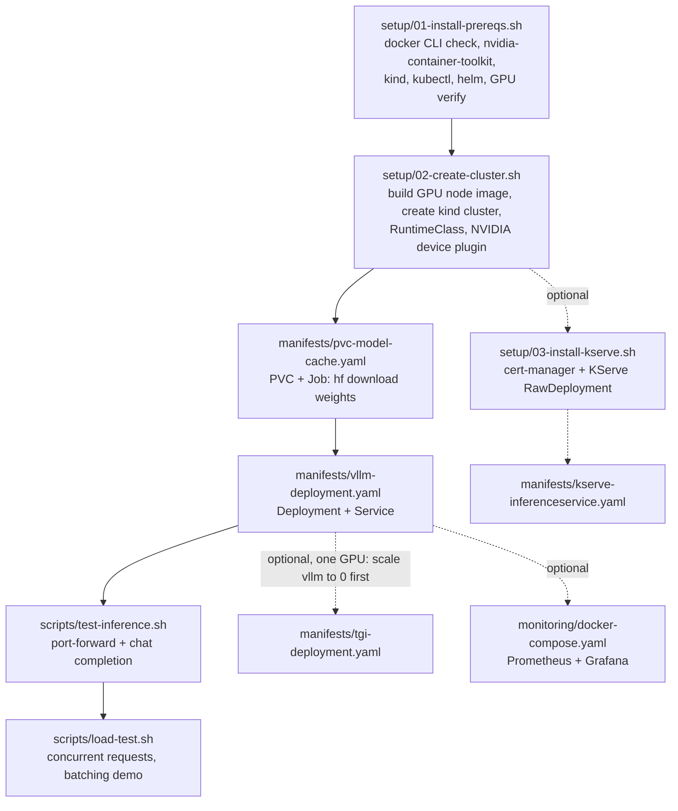
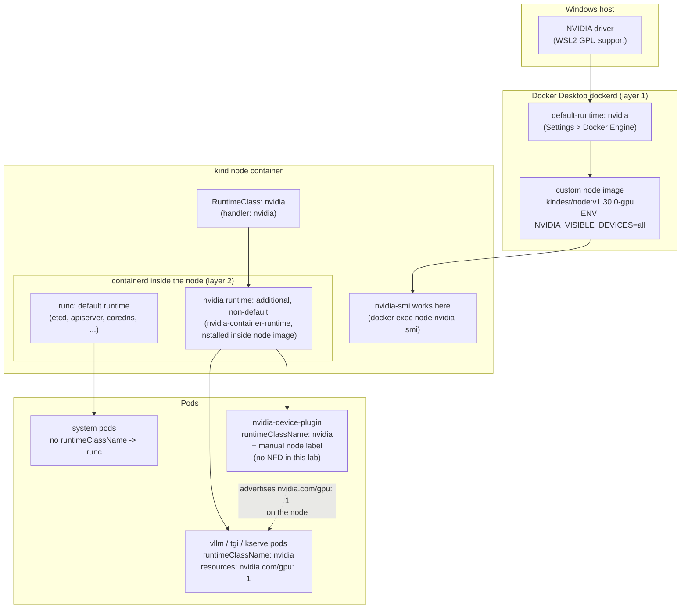

# Rill — GenAI on Kubernetes Local Practice Lab

Local single-node lab for practicing GenAI inference serving patterns on Kubernetes,
sized to run on a Windows 11 + WSL2 laptop with one 8GB VRAM GPU.

**Project status:** Incubating. **License:** [Apache 2.0](LICENSE) — see
[NOTICE](NOTICE) for what "incubating" means here (project maturity, not ASF
affiliation). **Contributing:** see [CONTRIBUTING.md](CONTRIBUTING.md) —
short version: read the troubleshooting log before filing a bug, test any
manifest/script change against a real cluster before submitting.

## Target hardware

- CPU: Intel Core Ultra 7 255HX
- RAM: 32GB
- GPU: NVIDIA RTX 5060 Laptop, 8GB VRAM
- Storage: ~750GB free
- OS: Windows 11 + WSL2 (Ubuntu) + Docker Desktop (WSL2 backend) + `kind`

Everything here is deliberately **single-GPU, single-node**. Comments in each
manifest call out what a production / multi-GPU setup would add that this lab
skips (tensor parallelism, disaggregated prefill/decode, DRA, autoscaling,
multi-replica HA, etc).

## Setup flow



## Prerequisites

- Windows 11 with WSL2 installed, **Ubuntu distro actually registered** — check
  with `wsl -l -v`. `wsl --install` alone does not always register a distro (seen
  in practice: it can report success and even survive a reboot with no Ubuntu
  entry showing up). If `wsl -l -v` doesn't list Ubuntu, explicitly run
  `wsl --install -d Ubuntu` and watch its output for real errors, then launch
  "Ubuntu" from the Start menu once to finish first-run user/password setup.
- NVIDIA driver on the **Windows host** (not inside WSL) with WSL2 GPU support
  — install from nvidia.com, version supporting your RTX 5060. This alone is
  enough for `nvidia-smi` and `docker run --gpus all` to work inside WSL — no
  extra driver install needed inside the Ubuntu distro itself.
- Docker Desktop for Windows, with "Use WSL2 based engine" and **WSL
  Integration enabled for your Ubuntu distro** (Settings > Resources > WSL
  Integration — toggle it on, Apply & Restart). Without this the `docker` CLI
  simply won't exist inside Ubuntu.
- A way to enter your `sudo` password interactively at least once per WSL
  session — `setup/01-install-prereqs.sh` needs real `sudo`, which fails
  silently/hangs if invoked non-interactively (e.g. from a driving script or
  tool that can't supply a TTY). Run it from a plain Ubuntu terminal you can
  type into.
- ~30GB free disk for model weights + images, out of your 750GB

## Quickstart

Once prerequisites are installed (see below) and the cluster has been created
at least once, day-to-day use is just:

```bash
bash start-rill.sh   # brings up cluster (if needed), vLLM, port-forward, monitoring
bash stop-rill.sh    # scales everything down, frees the GPU, stops monitoring
```

Both are idempotent — safe to run repeatedly. Neither deletes the kind
cluster or the downloaded model weights, so `start-rill.sh` after a
`stop-rill.sh` is fast (no re-download, no re-pull of the vLLM image).

## Project layout

```
genai-k8s-lab/
├── README.md
├── start-rill.sh                 # bring up the whole stack (idempotent)
├── stop-rill.sh                  # tear it back down, keep cluster/weights (idempotent)
├── kind-config.yaml
├── setup/
│   ├── 01-install-prereqs.sh     # docker CLI, nvidia-container-toolkit, kind, kubectl, helm
│   ├── 02-create-cluster.sh      # kind cluster + nvidia device plugin
│   ├── 03-install-kserve.sh      # KServe quickstart (Knative-less, RawDeployment mode)
│   └── 04-install-dashboard.sh   # Kubernetes Dashboard web UI + admin token
├── manifests/
│   ├── vllm-deployment.yaml      # vLLM OpenAI-compatible server
│   ├── tgi-deployment.yaml       # HF TGI server, same model, for comparison
│   ├── kserve-inferenceservice.yaml
│   ├── pvc-model-cache.yaml      # PVC + init-container HF Hub download pattern
│   ├── oci-volume-model.yaml     # OCI artifact volume mount pattern
│   └── dashboard-admin.yaml      # admin ServiceAccount for Kubernetes Dashboard
├── scripts/
│   ├── test-inference.sh         # port-forward + curl + jq chat completion
│   └── load-test.sh              # concurrent request load test
└── monitoring/
    ├── docker-compose.yaml       # Prometheus + Grafana (simplest path)
    ├── prometheus.yml
    └── grafana-dashboard-vllm.json
```

## Kubernetes operations reference

`start-rill.sh`/`stop-rill.sh` cover the common path. These are the raw
`kubectl`/`kind`/`helm` commands underneath, useful when you need finer
control than the scripts give you.

### Cluster / context

```bash
kind get clusters                              # list kind clusters on this machine
kubectl config get-contexts                    # confirm which context is active
kubectl config use-context kind-genai-lab      # switch to this lab's cluster
kubectl cluster-info                           # API server / CoreDNS endpoints
kubectl get nodes -o wide                      # node status, k8s version, IP
```

### Namespace and resource overview

```bash
kubectl get all -n genai                       # everything in the app namespace at a glance
kubectl get pods -n genai -o wide              # pods with node/IP
kubectl get pvc,pv -n genai                    # storage
kubectl get events -n genai --sort-by=.lastTimestamp   # recent cluster events, oldest last
```

### Deploying / redeploying individual pieces

```bash
kubectl apply -f manifests/pvc-model-cache.yaml
kubectl apply -f manifests/vllm-deployment.yaml
kubectl -n genai rollout restart deployment/vllm     # force a fresh pod without changing the manifest
kubectl -n genai rollout status deployment/vllm --timeout=600s
kubectl -n genai rollout undo deployment/vllm        # roll back to the previous ReplicaSet
```

### Scaling (this lab's one-GPU rule: only one of vllm/tgi/kserve-predictor at a time)

```bash
kubectl -n genai scale deployment/vllm --replicas=0   # free the GPU
kubectl -n genai scale deployment/vllm --replicas=1   # bring it back
kubectl -n genai get deployment                       # confirm desired vs available replicas
```

### Inspecting a specific pod

```bash
kubectl -n genai describe pod <pod-name>              # events, resource requests, conditions
kubectl -n genai logs <pod-name>                      # current container logs
kubectl -n genai logs <pod-name> --previous            # logs from the last crashed instance
kubectl -n genai logs -f <pod-name>                    # follow/tail live
kubectl -n genai exec -it <pod-name> -- bash            # shell into the container
kubectl -n genai top pod <pod-name>                    # live CPU/memory (needs metrics-server, not installed by default in kind)
```

### Cleanup levels (least to most destructive)

```bash
bash stop-rill.sh                                       # scale workloads to 0, stop monitoring — keeps cluster + weights
kubectl -n genai delete job model-download              # force a re-download next time (rare — only if weights are corrupt)
kind delete cluster --name genai-lab                    # full cluster teardown — loses the PVC/model weights too
```

After a full `kind delete cluster`, `bash start-rill.sh` rebuilds everything
from scratch (custom node image, RuntimeClass, device plugin, re-download of
weights) — expect the full first-run time described in "Known slow/first-run
steps" below, not the fast path.

### Helm (used for the NVIDIA device plugin)

```bash
helm -n kube-system list                                # confirm nvidia-device-plugin release
helm -n kube-system get values nvidia-device-plugin      # what values it's actually running with
helm -n kube-system uninstall nvidia-device-plugin       # remove it (breaks GPU scheduling until reinstalled)
```

## How GPU passthrough actually works here (read this before debugging)

There are **two separate layers** that both need to know about the GPU, and
getting only one of them right looks like progress but still ends in
`nvidia.com/gpu` never showing up as allocatable:



1. **Docker Desktop's own dockerd** (the thing that runs the `kind` node as a
   container). It needs `default-runtime: nvidia` set in Docker Desktop >
   Settings > Docker Engine, AND the container it starts must set
   `NVIDIA_VISIBLE_DEVICES=all` / `NVIDIA_DRIVER_CAPABILITIES=all` itself —
   `default-runtime` alone does **not** auto-inject the GPU into a container
   that doesn't ask for it (that only happens with `docker run --gpus all`,
   which `kind` has no way to pass). Fix: build a custom kind node image
   (`kindest/node:v1.30.0-gpu`, see `setup/02-create-cluster.sh`) with those
   env vars baked in via `ENV`, and reference it from `kind-config.yaml`'s
   `image:` field.

2. **The containerd running *inside* the kind node.** This is the thing that
   actually launches every pod (kubelet talks to it, not to Docker Desktop's
   dockerd). It has no idea the outer Docker Desktop has an nvidia runtime —
   it needs its own `nvidia-container-runtime` binary installed *inside the
   node image*, registered as a containerd runtime via
   `containerdConfigPatches` in `kind-config.yaml`, and selected per-pod via a
   Kubernetes `RuntimeClass` (`manifests` that need the GPU set
   `spec.runtimeClassName: nvidia`).

   **Important pitfall already hit once:** do NOT set this nvidia runtime as
   containerd's node-wide *default* (`default_runtime_name = "nvidia"`). That
   routes every system pod — etcd, kube-apiserver, coredns — through the
   nvidia runtime too, and on WSL2 (where there's no classic `/dev/nvidia*`
   char devices, only `/dev/dxg`) this reliably crash-loops etcd/apiserver
   into oblivion (`PostStartHook "crd-informer-synced" failed: timed out
   waiting for the condition`, restart counts climbing forever). Register
   `nvidia` as an **additional**, non-default runtime, and opt in per-pod with
   a `RuntimeClass` instead.

3. **The NVIDIA device plugin's default node-affinity assumes Node Feature
   Discovery (NFD) is running** (checking labels like
   `feature.node.kubernetes.io/pci-10de.present=true`). This lab doesn't run
   NFD, so the daemonset silently schedules 0 pods (`DESIRED: 0`) unless you
   label the node yourself (`nvidia.com/gpu.present=true`) and disable the
   chart's built-in affinity (`--set-json 'affinity={}'`). Both are already
   baked into `setup/02-create-cluster.sh`.

If `kubectl get nodes -o jsonpath='...allocatable.nvidia\.com/gpu'` comes back
blank right after the device-plugin daemonset reports "successfully rolled
out", that's usually just propagation lag (a couple seconds) — the script
polls for up to 30s before declaring failure. If it's still blank after that,
check `kubectl -n kube-system logs -l app.kubernetes.io/instance=nvidia-device-plugin`.

## Model choice

Default: **Qwen2.5-3B-Instruct**, bf16/fp16. At 3B params, fp16 weights are
~6GB, comfortably fits in 8GB VRAM alongside KV cache for short-to-medium
context and small batch size. If you hit OOM (e.g. other VRAM usage, bigger
context window), switch the model tag to the **AWQ 4-bit** quant
(`Qwen/Qwen2.5-3B-Instruct-AWQ`, ~2GB weights) — env var is called out in the
manifest.

## Inference stack reference (what's actually running)

| Item | Value |
|---|---|
| Model | `Qwen/Qwen2.5-3B-Instruct` (set via `MODEL_ID` env in `manifests/pvc-model-cache.yaml` and `--model` arg in `manifests/vllm-deployment.yaml` — keep both in sync if you change it) |
| Serving image | `vllm/vllm-openai:latest` (pinned `v0.6.3` fails on this GPU, see troubleshooting #11) |
| vLLM version actually served | reported at runtime in the API response's `system_fingerprint` field, e.g. `vllm-0.24.0-b5f79289` — check this instead of trusting the image tag, since `:latest` moves |
| Serving args | `--max-model-len=2048 --gpu-memory-utilization=0.85 --enforce-eager --tensor-parallel-size=1 --port=8000` (see `manifests/vllm-deployment.yaml` for why each of these values, specifically) |
| Model mount path (inside vLLM pod) | `/models/Qwen_Qwen2.5-3B-Instruct` (PVC `model-cache` mounted at `/models`; HF Hub repo id `/` is replaced with `_` by the download Job's `DEST` logic in `manifests/pvc-model-cache.yaml`) |
| HF Hub cache path (inside pod) | `/models/.cache` (`HF_HOME` env var — lock files, blob cache, etc, separate from the actual resolved weight files above) |
| PVC → real disk location | PVC is backed by kind's default `local-path-provisioner` StorageClass, which lands on the **kind node container's** filesystem (not your Ubuntu or Windows filesystem directly) at `/var/local-path-provisioner/<pv-name>_genai_model-cache` — see "Checking the model files on disk" below for how to actually get there |
| Namespace | `genai` (all app manifests; `kube-system` holds the device plugin and cluster-level components) |
| Service / port | `svc/vllm` in namespace `genai`, port `8000`, OpenAI-compatible (`/v1/chat/completions`, `/v1/completions`, `/health`, `/metrics`) |

## Run order (from scratch)

```bash
cd genai-k8s-lab

# 1. Install prerequisites inside WSL2 Ubuntu (one-time)
bash setup/01-install-prereqs.sh

# 2. Bring up the whole stack: cluster, GPU passthrough, vLLM, port-forward,
#    monitoring. Safe to re-run any time — see Quickstart above.
bash start-rill.sh

# 3. Test it
bash scripts/test-inference.sh

# 4. (optional) Load test / continuous batching demo
bash scripts/load-test.sh

# 5. (optional) Deploy TGI side-by-side for comparison — see README
#    troubleshooting #16-18 first: known unresolved GPU-arch limitation.
#    Scale vLLM to 0 first (one GPU): kubectl -n genai scale deployment/vllm --replicas=0
kubectl apply -f manifests/tgi-deployment.yaml

# 6. (optional) Install KServe and deploy the InferenceService wrapper
bash setup/03-install-kserve.sh
kubectl apply -f manifests/kserve-inferenceservice.yaml

# 7. (optional) Kubernetes Dashboard web UI
bash setup/04-install-dashboard.sh

# When done for the day:
bash stop-rill.sh
```

`start-rill.sh`/`stop-rill.sh` cover the core vLLM + monitoring path only —
TGI, KServe, and the Dashboard are opt-in extras layered on top (steps 5-7
above), since this laptop has exactly one GPU and vLLM is the primary demo.

See bottom of this file for the exact copy-pasteable command list.

## Notes on scale-down decisions vs production

- Single `kind` node = single GPU = every Deployment requests exactly
  `nvidia.com/gpu: 1`. No GPU sharing, no MIG, no multi-instance GPU slicing.
- No tensor/pipeline parallelism — vLLM and TGI both run `--tensor-parallel-size 1`.
- No disaggregated prefill/decode (a production vLLM setup at scale often
  splits these across separate worker pools).
- No Dynamic Resource Allocation (DRA) — using the older device-plugin model,
  which is what actually works simply in `kind`.
- No HPA/KEDA autoscaling on GPU metrics — one replica, always on.
- KServe here runs in **RawDeployment** mode (plain Deployment/Service under
  the hood), skipping the Knative serverless layer that production KServe
  usually uses for scale-to-zero and request-based autoscaling.

## Exact command list (copy-paste from scratch)

```bash
cd genai-k8s-lab
chmod +x setup/*.sh scripts/*.sh start-rill.sh stop-rill.sh

bash setup/01-install-prereqs.sh
bash start-rill.sh

bash scripts/test-inference.sh
```

## Monitoring stack (Prometheus + Grafana)

Runs as plain `docker-compose`/`docker compose` outside the kind cluster
(see `monitoring/docker-compose.yaml` for why — Prometheus Operator inside
kind was judged too heavy for this lab). It scrapes vLLM's `/metrics` through
a `kubectl port-forward`, not in-cluster service discovery, so the
port-forward has to be kept running for metrics to flow.

```bash
# 1. Keep a port-forward to vLLM alive in its own terminal/background process
#    (must stay running the whole time monitoring is up — Prometheus scrapes
#    host.docker.internal:8000, which only resolves while this is active)
kubectl -n genai port-forward --address 0.0.0.0 svc/vllm 8000:8000

# 2. In another terminal, bring up the stack
cd monitoring
docker compose up -d

# 3. Verify Prometheus actually sees vLLM as a healthy scrape target
curl -s http://localhost:9090/api/v1/targets | grep -o '"health":"[a-z]*"'

# 4. Grafana: http://localhost:3000 (admin/admin, or anonymous Viewer access
#    is enabled by default — see GF_AUTH_ANONYMOUS_ENABLED in docker-compose.yaml)
#    Dashboard "vLLM Lab Dashboard" (uid vllm-lab) is auto-provisioned — no
#    manual import needed. Confirm it's there:
curl -s -u admin:admin http://localhost:3000/api/search?query=vllm
```

Panels are empty until vLLM has actually served some requests — run
`scripts/test-inference.sh` or `scripts/load-test.sh` against it first (or
just wait; the port-forward + Prometheus scrape alone produces the
process/GC metrics, but the interesting panels need real traffic). Confirmed
working by checking vLLM's raw metrics directly after a load test:

```bash
curl -s http://localhost:8000/metrics | grep -E 'vllm:generation_tokens_total|vllm:request_success_total'
```

### Dashboard panels (10 total, `monitoring/grafana-dashboard-vllm.json`)

| Panel | What it shows | Why it matters |
|---|---|---|
| Tokens/sec (prompt vs generation) | `rate(vllm:{prompt,generation}_tokens_total[1m])` | Raw throughput, split by prefill vs decode work |
| Time to First Token (p50/p95/p99) | `vllm:time_to_first_token_seconds` | Latency the user waits before the first token streams back |
| Running / Waiting Requests | `vllm:num_requests_{running,waiting}` | Continuous batching in action — how many requests the scheduler is packing together vs queuing |
| KV Cache Usage % | `vllm:kv_cache_usage_perc` | How close to the VRAM/KV-cache ceiling you are — climbing toward 100% is your early warning before OOM (see troubleshooting #13-15) |
| Inter-Token Latency / TPOT (p50/p95) | `vllm:inter_token_latency_seconds`, `vllm:request_time_per_output_token_seconds` | Per-token decode speed once generation has started (distinct from TTFT) |
| End-to-End Request Latency (p50/p95/p99) | `vllm:e2e_request_latency_seconds` | What the client actually experiences start-to-finish — the number that matters most to a caller |
| Request Time Breakdown: Queue vs Prefill vs Decode | `vllm:request_{queue,prefill,decode}_time_seconds` | Where time is actually going per request — a growing queue-time share means you're saturated (see the concurrency test above) |
| Prefix Cache Hit Rate | `vllm:prefix_cache_hits_total / vllm:prefix_cache_queries_total` | How often repeated/shared prompt prefixes skip recomputation (this lab runs with `enable_prefix_caching=True` by default) |
| Request Outcomes (success/preemption rate) | `vllm:request_success_total` (by `finished_reason`), `vllm:num_preemptions_total` | Preemptions climbing means the scheduler is evicting in-flight requests under memory pressure — a concrete signal to lower concurrency or `--max-model-len` |
| Prompt/Generation Token Count per Request | `vllm:request_{prompt,generation}_tokens` | Distribution of request sizes actually being served — useful for sanity-checking load test parameters against real traffic shape |

Metric names are version-specific — this lab's vLLM (`0.24.0`, see the
inference stack reference table above) uses `vllm:kv_cache_usage_perc`; older
vLLM releases called this `vllm:gpu_cache_usage_perc`. If panels go blank
after a vLLM upgrade, diff the metric names with
`curl -s http://localhost:8000/metrics | grep '^# TYPE vllm'` before assuming
something's broken.

Tear down with `docker compose down` in `monitoring/`; the port-forward is a
separate process, kill it separately (`pkill -f 'port-forward svc/vllm'`).

## Web UI for browsing pod status (Kubernetes Dashboard)

`kubectl` covers everything above, but for visually browsing pods/deployments/
logs/events instead of typing commands, the official Kubernetes Dashboard
works fine on kind:

```bash
bash setup/04-install-dashboard.sh
```

This installs the dashboard, an admin `ServiceAccount`
(`manifests/dashboard-admin.yaml` — `cluster-admin` scope, fine for this
single-user local lab), and prints a 24h login token. Then:

```bash
kubectl -n kubernetes-dashboard port-forward svc/kubernetes-dashboard 8443:443
```

Open **https://localhost:8443** in your Windows browser (WSL2 port-forwards
are reachable from Windows automatically). Browser will warn about the
self-signed cert — proceed anyway. Log in with **Token**, pasting the value
printed by the install script (or regenerate anytime:
`kubectl -n kubernetes-dashboard create token dashboard-admin --duration=24h`).

From there you can browse the `genai` namespace to see pod status, click into
a pod for its logs/events/describe output, and watch resource usage — same
information as the `kubectl` commands throughout this README, just clickable.
Other options if you'd rather not run an in-cluster web UI: `k9s` (terminal
UI, no cluster-side install, just a CLI tool) or Lens/OpenLens (full desktop
app on Windows, points at the same kubeconfig kind already wrote).

## Monitoring the KServe InferenceService with kubectl

KServe wraps the same vLLM container as `manifests/vllm-deployment.yaml`, but
adds its own resources (`InferenceService`, a generated `Deployment`, a
generated `Service`) on top, and RawDeployment mode means there's no Knative
dashboard or `kn` CLI here — everything is observed the plain `kubectl` way.
Same one-GPU rule applies: scale `manifests/vllm-deployment.yaml` to 0 before
deploying this (`kubectl -n genai scale deployment/vllm --replicas=0`).

```bash
# 1. Deploy it
kubectl apply -f manifests/kserve-inferenceservice.yaml

# 2. Watch the InferenceService reach Ready — this is the top-level status,
#    check this first before digging into pods
kubectl -n genai get inferenceservice qwen-vllm
kubectl -n genai wait --for=condition=Ready inferenceservice/qwen-vllm --timeout=600s

# 3. If it's stuck (not Ready, no pod appearing), the InferenceService's own
#    Events are the first place to look — KServe's admission/reconcile errors
#    show up here, not in pod events (see README troubleshooting #19/#20 for
#    two real examples: CRD annotation size limit, cpu limit/request conflict)
kubectl -n genai describe inferenceservice qwen-vllm

# 4. KServe names the generated Deployment/pod <isvc-name>-predictor —
#    find and inspect it same as any other pod
kubectl -n genai get pods -l serving.kserve.io/inferenceservice=qwen-vllm
kubectl -n genai logs -l serving.kserve.io/inferenceservice=qwen-vllm --tail=50
kubectl -n genai describe pod -l serving.kserve.io/inferenceservice=qwen-vllm

# 5. Find the generated Service (also named <isvc-name>-predictor) to reach it
kubectl -n genai get svc qwen-vllm-predictor
kubectl -n genai port-forward svc/qwen-vllm-predictor 8081:80

# 6. Test it — same OpenAI-compatible API as plain vLLM, since KServe is just
#    passing traffic through to the same container. Cold first request can be
#    slow (--enforce-eager, no CUDA graphs — see troubleshooting #21); give it
#    a generous timeout before assuming it's stuck.
curl -m 60 http://localhost:8081/v1/chat/completions \
  -H 'Content-Type: application/json' \
  -d '{"model":"Qwen/Qwen2.5-3B-Instruct","messages":[{"role":"user","content":"Hi"}],"max_tokens":20}'

# 7. The InferenceService's own printed URL (http://qwen-vllm-genai.example.com)
#    is NOT directly reachable in this lab — it's KServe's external-facing
#    convention for when an Ingress/Istio gateway is in front (production
#    setups). Without one (this lab has none), always reach it via the
#    port-forward above, not that URL.

# 8. Tear down / free the GPU for something else
kubectl -n genai delete inferenceservice qwen-vllm
kubectl -n genai scale deployment/vllm --replicas=1   # bring vLLM back
```

Key thing to remember: `kubectl get inferenceservice` is the right first
command whenever something's wrong — it tells you whether the problem is
KServe's own reconciliation (webhook rejections, CRD issues, resource
conflicts) versus a normal pod-level problem you'd debug the same way as any
other Deployment.

## Concurrency / load test results (this hardware, this model)

Ran `scripts/load-test.sh` (Python asyncio fallback — `hey` wasn't installed)
against the running vLLM pod at increasing concurrency, same prompt each time
(`max_tokens=150`), to see where continuous batching stops absorbing extra
concurrent load and the GPU itself becomes the bottleneck:

| Concurrency | Requests | Total time | Throughput | p50 latency | p95 latency | max latency |
|---|---|---|---|---|---|---|
| 10 | 50 | 7.93s | 6.31 req/s | 1.50s | 1.72s | 1.93s |
| 40 | 200 | 14.62s | 13.68 req/s | 1.66s | 1.92s | 2.04s |
| 80 | 400 | 27.68s | 14.45 req/s | 1.62s | 1.84s | 2.11s |
| 100 | 500 | 34.78s | 14.37 req/s | 1.63s | 1.86s | 2.23s |

**Reading this:** 10→40 concurrency (4x) more than doubled throughput
(6.31→13.68 req/s) while p50/p95 latency barely moved — that's continuous
batching working as intended, packing multiple requests' decode steps
together instead of serializing them. But 40→80→100 (up to 10x the original
concurrency) produced **no further throughput gain** — it's flat at
~14.4 req/s, with latency roughly flat too (not blowing up, just not
improving). That flat ceiling is the actual saturation point for this
model+GPU+settings combination: the GPU's compute (not request queuing, not
KV cache capacity — `--max-model-len=2048` and `--gpu-memory-utilization=0.85`
leave enough KV cache headroom that this wasn't cache-limited in this test) is
fully occupied somewhere between concurrency 40 and 80. Pushing concurrency
higher than that just makes more requests wait in the scheduler queue for the
same ~14.4 req/s of GPU throughput — it doesn't buy anything.

For reference, this is specifically useful to know when comparing against TGI
(`manifests/tgi-deployment.yaml`) or tuning `--max-num-seqs` /
`--gpu-memory-utilization` further — re-run the same table shape after any
change to see whether the ceiling actually moved, rather than eyeballing a
single run.

To reproduce with different parameters:
```bash
CONCURRENCY=<n> REQUESTS=<n> bash scripts/load-test.sh
```

## Known slow/first-run steps (don't assume something's broken)

- **`hf download` in the model-download Job**: pulls ~6GB for
  Qwen2.5-3B-Instruct over the Hub. Several minutes on a normal connection.
  Watch it with `kubectl -n genai logs -f job/model-download`.
- **`vllm/vllm-openai` image pull**: this image is large (multi-GB, CUDA +
  torch + the works). First pull into the kind node can take several minutes
  even on a fast connection — `kubectl -n genai get pods` will show
  `ContainerCreating` the whole time with no error. Only worry if it's been
  stuck with zero progress for 15+ minutes; check
  `docker exec <cluster>-control-plane crictl images` to confirm the pull is
  actually progressing.
- Both of the above are one-time costs — cached on the node/PVC after the
  first successful run, so re-creating pods (not the whole cluster) is fast.

## Checking each interface in the flow

Run these in order to isolate which layer is broken — each one only makes
sense if the layer before it is healthy.

```bash
# 1. Windows NVIDIA driver + WSL2 GPU visibility (no docker involved yet)
nvidia-smi

# 2. Docker Desktop's own nvidia runtime (layer 1 in the diagram above)
docker info | grep -i "Default Runtime"
docker run --rm --gpus all nvidia/cuda:12.4.1-base-ubuntu22.04 nvidia-smi

# 3. kind node container has the GPU (still layer 1 — outer docker exec)
docker ps --filter name=genai-lab-control-plane
docker exec genai-lab-control-plane nvidia-smi

# 4. containerd inside the node has nvidia-container-runtime installed
#    and registered (layer 2 in the diagram)
docker exec genai-lab-control-plane which nvidia-container-runtime
docker exec genai-lab-control-plane cat /etc/containerd/config.toml | grep -A5 'runtimes.nvidia'

# 5. Kubernetes RuntimeClass exists and points at the right handler
kubectl get runtimeclass nvidia -o yaml

# 6. Node advertises nvidia.com/gpu (device plugin working end to end)
kubectl get nodes -o jsonpath='{range .items[*]}{.metadata.name}{"\t"}{.status.allocatable.nvidia\.com/gpu}{"\n"}{end}'
kubectl -n kube-system get pods -l app.kubernetes.io/instance=nvidia-device-plugin

# 7. Model weights actually downloaded onto the PVC
kubectl -n genai get job model-download
kubectl -n genai exec deploy/vllm -- ls -la /models/Qwen_Qwen2.5-3B-Instruct

# 8. vLLM pod itself: scheduled, running, GPU-scheduled, ready
kubectl -n genai get pods -o wide
kubectl -n genai describe pod -l app=vllm | grep -A3 "Limits:\|State:"

# 9. vLLM's own health/readiness, from inside the cluster (no port-forward needed)
kubectl -n genai exec deploy/vllm -- curl -s localhost:8000/health

# 10. End-to-end from your machine
bash scripts/test-inference.sh
```

## Checking the model files on disk

The PVC's actual files live inside the **kind node container**, not directly
on your Ubuntu or Windows filesystem (see the mount-path table above):

```bash
# Find the PV backing the PVC, and its hostPath inside the node container
PVNAME=$(kubectl -n genai get pvc model-cache -o jsonpath='{.spec.volumeName}')
kubectl get pv "$PVNAME" -o jsonpath='{.spec.hostPath.path}'; echo

# Browse it via docker exec (path from the command above)
docker exec genai-lab-control-plane ls -la /var/local-path-provisioner/<pv-name>_genai_model-cache

# Or just ask the running pod directly — simpler, same underlying files
kubectl -n genai exec deploy/vllm -- du -sh /models/Qwen_Qwen2.5-3B-Instruct
kubectl -n genai exec deploy/vllm -- ls -la /models/Qwen_Qwen2.5-3B-Instruct
```

There's no plain Windows Explorer or WSL Ubuntu path to these files — they're
nested two container layers deep (kind node container, itself inside Docker
Desktop's own hidden WSL2 VM backed by a `.vhdx`).

## Debugging playbook by component

**Docker Desktop / Docker Engine**
- `docker info | grep -i runtime` — confirms `default-runtime: nvidia` and
  that `nvidia` is in the list of available runtimes.
- Docker Desktop won't pick up Docker Engine settings changes without
  **Apply & Restart** — a saved JSON with no restart is a no-op.
- `docker ps -a` — if the kind node container isn't `Up`, nothing above it
  will work; check `docker logs genai-lab-control-plane`.
- WSL integration toggle lives in Docker Desktop > Settings > Resources > WSL
  Integration — must be enabled per-distro, not just "WSL2 backend" globally.

**NVIDIA / GPU**
- `nvidia-smi` (bare, in WSL Ubuntu) — if this fails, the problem is the
  Windows-host driver, not anything in this repo; reinstall/update the
  NVIDIA driver from nvidia.com with WSL2 GPU support.
- `nvidia-smi --query-gpu=memory.used,memory.total --format=csv` — check
  actual VRAM headroom before tuning `--gpu-memory-utilization`. Remember
  WSL2 hides ~1GiB of accounting overhead from this output (troubleshooting
  #14) — trust the error message from the process that actually tried to
  allocate over what's free, not this number alone.
- `docker exec genai-lab-control-plane nvidia-smi` failing but the bare host
  command working means the *node image* is the problem — rebuild it
  (`docker build ... kindest/node:v1.30.0-gpu`, see `setup/02-create-cluster.sh`)
  and recreate the cluster.
- CUDA errors mentioning "no kernel image is available" mean the vLLM/TGI
  image's bundled CUDA/torch build predates support for your GPU's compute
  capability — try `:latest` or a newer tag.

**Kubernetes / kind**
- `kubectl get nodes -o wide` — confirms the node is `Ready` at all before
  chasing GPU-specific symptoms.
- `kubectl get runtimeclass` — confirms `nvidia` RuntimeClass exists; a pod
  referencing a RuntimeClass that doesn't exist stays `Pending` with an event
  like `RuntimeClass "nvidia" not found`.
- `kubectl -n kube-system get ds nvidia-device-plugin` — check `DESIRED`
  isn't `0`; if it is, the daemonset's pod affinity doesn't match this node's
  labels (troubleshooting #7) — check
  `kubectl -n kube-system get ds nvidia-device-plugin -o jsonpath='{.spec.template.spec.affinity}'`.
- `kubectl -n <ns> describe pod <name>` — read the `Events:` section top to
  bottom; it tells you exactly which step (scheduling, image pull, probe,
  container start) is stuck, before you go anywhere near logs.
- `kubectl -n <ns> logs <pod> --previous` — logs from the container's *last*
  crashed instance; the current instance's logs are often too short-lived to
  `kubectl logs` before it restarts again.
- To reset the whole cluster and start clean:
  `kind delete cluster --name genai-lab && bash setup/02-create-cluster.sh`
  (the PVC/model weights are lost too — re-run the download Job after).

**vLLM / inference**
- `kubectl -n genai logs -l app=vllm --previous --tail=100 | grep -B3 -A20 Error` —
  vLLM's crash traceback is long; searching for the last `Error`/`ValueError`
  block is faster than scrolling.
- `EngineCore failed to start. ... Failed core proc(s): {}` in the API
  server's logs is *never* the real error — it's the outer process reporting
  that the inner `EngineCore` subprocess died. Always look at the
  `(EngineCore pid=...)`-prefixed lines above it for the actual cause.
- A `VLLM_PORT` (or any env var matching your Service's name) shows up
  wrong/unexpected — check `kubectl -n genai exec deploy/vllm -- env | grep -i vllm`
  for Kubernetes' auto-injected Docker-links-style service env vars colliding
  with the app's own env vars (troubleshooting #10).
- `curl localhost:8000/metrics` (from inside the pod, or via port-forward) —
  Prometheus-format metrics including `vllm:num_requests_running`,
  `vllm:gpu_cache_usage_perc`, `vllm:time_to_first_token_seconds_bucket` —
  useful for checking the engine is alive even before the chat endpoint works.

## Troubleshooting log (issues actually hit setting this up, in order)

This is what happened, in sequence, getting this lab running the first time —
kept here so the next person doesn't have to rediscover it.

1. **`wsl --install` reported success but no distro was registered.** `wsl -l -v`
   only showed `docker-desktop`. Re-running `wsl --install -d Ubuntu`
   explicitly (and actually watching its output) fixed it; the first attempt
   had silently not completed.
2. **`docker` not found inside Ubuntu.** Needed Docker Desktop > Settings >
   Resources > WSL Integration > toggle on for the Ubuntu distro.
3. **`setup/01-install-prereqs.sh` hung on `sudo`.** Any driving process that
   can't supply a TTY/password (e.g. a script or tool invoking
   `wsl -e bash -lc "..."` non-interactively) will hang or fail at the first
   `sudo` call. Must run interactively from a real terminal at least the first
   time, or set up passwordless sudo yourself if you understand the tradeoff.
4. **kind node had no GPU (`nvidia-smi` "executable file not found").** Setting
   `default-runtime: nvidia` in Docker Desktop's Docker Engine settings was
   necessary but not sufficient — see "How GPU passthrough actually works
   here" above. Needed a custom node image with `NVIDIA_VISIBLE_DEVICES=all`
   baked in via `ENV`.
5. **GPU visible via `docker exec <node> nvidia-smi`, but pods still got no
   GPU and `nvidia.com/gpu` never showed up as allocatable.** This is because
   the *inner* containerd (the one actually running pods) doesn't share
   Docker Desktop's runtime config at all. Had to install
   `nvidia-container-toolkit` inside the custom node image and register it as
   a containerd runtime.
6. **First attempt at #5 set the nvidia runtime as containerd's cluster-wide
   default.** This crash-looped etcd and kube-apiserver (WSL2 has no
   `/dev/nvidia*` devices, only `/dev/dxg`, and something about routing every
   system container through the nvidia runtime broke cache-sync post-start
   hooks). Fixed by registering `nvidia` as an *additional* runtime instead,
   selected per-pod via a `RuntimeClass`, leaving `runc` as the default for
   everything else.
7. **Device plugin daemonset stayed at `DESIRED: 0`, scheduled onto nothing.**
   Its default affinity requires labels Node Feature Discovery would normally
   set. Fixed by manually labeling the node `nvidia.com/gpu.present=true` and
   overriding the chart's affinity to empty.
8. **`kubectl get nodes -o jsonpath='...allocatable.nvidia\.com/gpu'` came back
   blank immediately after "daemon set successfully rolled out".** Just
   propagation lag — polling for a few seconds resolved it. Baked a retry loop
   into `setup/02-create-cluster.sh` so this doesn't look like a failure.
9. **Model-download Job failed with `huggingface-cli: deprecated, no longer
   works`.** The installed `huggingface_hub` version had dropped the old CLI
   entrypoint in favor of `hf`. Fixed `manifests/pvc-model-cache.yaml` to call
   `hf download` instead of `huggingface-cli download`.
10. **vLLM pod crash-looped with `invalid literal for int() with base 10:
    'tcp://10.96.107.48:8000'`.** Kubernetes auto-injects a `VLLM_PORT=tcp://
    <svc-ip>:8000` env var into every pod once a Service named `vllm` exists
    (legacy Docker-links-style service env injection), and vLLM reads its own
    `VLLM_PORT` env var expecting a bare port number — the two collide. Fixed
    by explicitly setting `VLLM_PORT: "8000"` in the container's own `env:`,
    which wins over the auto-injected one. Worth remembering for *any*
    container whose Service name matches one of its own env var names.
11. **vLLM crashed with `CUDA error: no kernel image is available for
    execution on the device`.** The pinned `vllm/vllm-openai:v0.6.3` image
    bundles a torch/CUDA build with no compiled kernels for this GPU's compute
    capability — it's newer than what that image version was built against.
    Fixed by switching to `vllm/vllm-openai:latest`. General lesson: on a very
    new GPU, don't pin old inference-server image tags; confirm the image
    actually starts before pinning a specific version for reproducibility.
12. **vLLM pod got killed by the liveness probe mid-startup** (`Container vllm
    failed liveness probe, will be restarted`), even though it was making
    progress loading the model. `initialDelaySeconds: 60` was too short — on a
    cold start, weight loading plus vLLM's `torch.compile` warmup pass easily
    takes several minutes, especially the first time (no compile cache yet).
    Fixed by bumping `livenessProbe.initialDelaySeconds` to 240s in
    `manifests/vllm-deployment.yaml`. Readiness probe was already generous
    (`failureThreshold: 30` at 10s intervals = 5 minutes) so it wasn't the
    problem — only liveness needed the same treatment.
13. **Engine failed to start with `available KV cache memory (0.02 GiB)` less
    than the `0.14 GiB` needed.** On an 8GB card, Qwen2.5-3B's ~6GB of fp16
    weights plus vLLM's CUDA graph capture overhead (~0.3-0.5GB) left almost
    nothing for the actual KV cache at `--gpu-memory-utilization=0.85` /
    `--max-model-len=4096`. Fixed by dropping to `--max-model-len=2048`,
    raising `--gpu-memory-utilization=0.92`, and adding `--enforce-eager`
    (skips CUDA graph capture entirely — costs some per-token latency, but on
    a card this tight on VRAM there's no room for graphs anyway). General
    lesson: on an 8GB card, "weights fit" isn't the same as "weights + KV
    cache + CUDA graph overhead fit" — check the engine actually reports a
    usable KV cache size, not just that the model loads.
14. **Bumping `--gpu-memory-utilization` to 0.92 to fix #13 caused a different
    failure**: `Free memory on device cuda:0 (6.87/7.96 GiB) on startup is
    less than desired GPU memory utilization (0.92, 7.32 GiB)`. Even with
    `nvidia-smi` reporting `0 MiB` used, CUDA inside the container only saw
    ~6.87GiB free out of the card's ~7.96GiB total — WSL2's paravirtualized
    GPU memory accounting reserves roughly 1.1GiB that never attributes to a
    specific process in `nvidia-smi`'s output. Since
    `--gpu-memory-utilization` is a fraction of the card's *total* memory, not
    of what's actually free, 0.92 overshot what was really available. Settled
    on `--gpu-memory-utilization=0.80` as a first attempt.
15. **`0.80` then undershot the other way**: `No available memory for the
    cache blocks. Try increasing gpu_memory_utilization`. With `--enforce-eager`
    (no CUDA graph reservation) and ~6GB of fp16 weights already loaded, 0.80
    of the 7.96GiB total (6.37GiB) left almost nothing over the weight
    footprint for any KV cache blocks at all. The usable window on this card
    turned out to be narrow: above the ~6GB weight floor, below the ~6.87GiB
    WSL2-visible ceiling. **`--gpu-memory-utilization=0.85` (6.77GiB) is what
    actually works** — this is the value in `manifests/vllm-deployment.yaml`
    today. General lesson: don't stop at the first value that avoids one
    error; confirm the pod reaches `Running` + `1/1 Ready` and actually serves
    a request, not just that it gets further than before.

16. **TGI hit the identical GPU-too-new problem as vLLM**: pinned
    `ghcr.io/huggingface/text-generation-inference:2.3.1` warned `NVIDIA
    GeForce RTX 5060 Laptop GPU with CUDA capability sm_120 is not compatible
    with the current PyTorch installation` (supported list stopped at
    `sm_90`). Fixed the same way as troubleshooting #11: switched
    `manifests/tgi-deployment.yaml` to `:latest`. Confirms the general lesson
    from #11 applies to any pinned inference-server image on a brand-new GPU,
    not just vLLM specifically.
17. **TGI (`:latest`) crashed with `ShardCannotStart`**, root cause a few
    screens up in the logs: `CalledProcessError: ... ['/usr/bin/gcc', ...,
    '-lcuda', ...] returned non-zero exit status 1`. TGI's default attention
    backend (flashinfer) JIT-compiles a Triton kernel at startup, which tries
    to link against `-lcuda` — WSL2 doesn't expose a standard linkable
    `libcuda.so` path the way a bare-metal Linux NVIDIA driver install does,
    so the link step fails. First tried `env: ATTENTION=paged` +
    `--disable-custom-kernels` to route around flashinfer's compile entirely —
    the paged-attention path hit the *same* `-lcuda` link error, proving it
    wasn't flashinfer-specific. Root cause confirmed via a throwaway debug pod
    (`kubectl run tgi-debug ... find / -iname libcuda.so*`): the image
    actually ships a working unversioned `libcuda.so` at
    `/usr/local/cuda-12.4/compat/libcuda.so`, but Triton's own `-L` flags only
    point at `/usr/lib/wsl/drivers/.../` (which has only the versioned
    `libcuda.so.1`, no plain `libcuda.so`). Real fix: `env:
    LIBRARY_PATH=/usr/local/cuda-12.4/compat` (additive to gcc's link search
    path) — confirmed no more `CalledProcessError` on gcc/`-lcuda` after this.
    WSL2-specific lesson distinct from #11/#16 (those were "GPU too new for
    this image version"; this one is "a working library exists but isn't on
    the compiler's default search path under WSL2").
18. **UNRESOLVED / known limitation: TGI still doesn't serve on this GPU**,
    even past #17's fix. Next failure: `CUDA Error: no kernel image is
    available for execution on the device
    /usr/src/flash-attention/csrc/layer_norm/ln_fwd_kernels.cuh` — a
    **precompiled** (not JIT'd) flash-attention kernel with no `sm_120`
    variant baked in, imported by `mamba_ssm`'s fused layer-norm path while
    loading the Qwen2 model, regardless of attention backend selected. Tried
    `env: USE_FLASH_ATTENTION=0` — didn't help, since this kernel isn't gated
    by that flag; it's a hard-coded import in the model-loading path, not
    routed through TGI's public backend-selection flags. Unlike #11/#16
    (fixed by using `:latest`) and #17 (fixed by an env var), this needs
    either a custom TGI image rebuilt with `sm_120` in its kernel compile
    target list, or an upstream TGI release that ships one — nothing
    controllable from this repo's manifests alone. **Left
    `manifests/tgi-deployment.yaml` scaled to `replicas: 0`** (as it started)
    rather than keep chasing this; vLLM (`manifests/vllm-deployment.yaml`)
    already fully demonstrates the lab's actual goal, and TGI was always the
    optional side-by-side comparison. Revisit if HuggingFace ships a TGI image
    with `sm_120` support, or if you're running an older/different GPU.
19. **KServe install failed with `metadata.annotations: Too long: must have at
    most 262144 bytes`** applying `kserve.yaml`. `kubectl apply` (client-side)
    stores the whole manifest in the `kubectl.kubernetes.io/last-applied-configuration`
    annotation, and KServe's `InferenceService` CRD is large enough to exceed
    the 256KB annotation size limit. Fixed by using
    `kubectl apply --server-side --force-conflicts` instead (server-side apply
    doesn't use that annotation at all) — updated
    `setup/03-install-kserve.sh` accordingly. General lesson: any sufficiently
    large CRD (KServe, cert-manager, Prometheus Operator, etc) can hit this;
    server-side apply is the standard fix, not a workaround specific to
    KServe.
20. **`InferenceService` predictor failed to reconcile**: `spec.template.spec.containers[0].resources.requests:
    Invalid value: "2": must be less than or equal to cpu limit of 1`. Our
    `manifests/kserve-inferenceservice.yaml` set `requests.cpu: "2"` but no
    explicit `limits.cpu` — KServe's defaulting webhook injects `cpu: "1"` as
    a default limit when none is set, which then conflicts with the explicit
    request. Fixed by adding `limits.cpu: "2"` explicitly. This is
    KServe-specific: the plain Deployments (`vllm-deployment.yaml`,
    `tgi-deployment.yaml`) don't go through this defaulting webhook and never
    hit it despite having the same cpu-request-without-limit shape.
21. **First chat completion request through the KServe predictor appeared to
    hang** (`curl` timed out at 30s, `/health` responded instantly). Not
    actually broken — cold-start inference under `--enforce-eager` (no CUDA
    graphs, see troubleshooting #13) is slower per-request than warmed-up
    graphs would be, and this was the very first real request hitting a
    freshly-loaded engine. Retrying with a longer client timeout (60s)
    succeeded immediately. Lesson: distinguish "the endpoint is broken" from
    "the endpoint is just slow" by checking a lightweight endpoint (`/health`)
    first — if that's fast, give the real endpoint more time before
    concluding it's stuck.

With all of the above applied, the InferenceService reaches `READY: True` and
serves real chat completions — confirmed with a live request returning an
actual model response. Same one-GPU constraint as TGI: scale
`manifests/vllm-deployment.yaml` to 0 first (`kubectl -n genai scale
deployment/vllm --replicas=0`), and scale it back before returning to the
primary vLLM demo.

Net result: `kind-config.yaml` uses a custom GPU-enabled node image +
non-default `nvidia` containerd runtime + `containerdConfigPatches`, and
`setup/02-create-cluster.sh` handles the node-label/affinity workaround and
polls for GPU capacity — all of this is already done for you. This log is here
so if something breaks again (e.g. a kind/toolkit version bump changes
behavior), you know which layer to suspect first.

## Roadmap: cloud deployment via Terraform (design proposal, not yet built)

Everything in this repo runs on one laptop GPU. The natural next step is
proving the same manifests scale onto a real managed Kubernetes service with
real GPU node pools — AWS EKS, Azure AKS, and GCP GKE. This section is a
**design proposal for contributors to build against**, not implemented code —
see [CONTRIBUTING.md](CONTRIBUTING.md) for how to propose the actual module
structure before submitting a large PR.

### Why this is a bigger change than it looks

Everything that made the local WSL2 setup painful (see the troubleshooting
log above) goes away on real cloud GPU nodes — no nested-container GPU
passthrough hack, no WSL2 VRAM-accounting quirks, no `containerdConfigPatches`
workarounds, because kubelet runs directly on a real Linux GPU node. But new
problems that don't exist locally show up instead:

- **Cost control.** A single L4/A10G/A100 node left running is real money.
  Any Terraform module needs a scale-to-zero or scheduled shutdown path baked
  in by default, not left as a footnote.
- **Multi-GPU becomes real, not hypothetical.** Every manifest in this repo
  currently hard-codes `nvidia.com/gpu: 1` on purpose (see each manifest's
  "PRODUCTION DIFFERENCE" comments) — cloud deployment is where
  tensor-parallelism, DRA, and multi-replica HA (all explicitly skipped here)
  actually need to get built, not just described in a comment.
- **Networking and IAM are provider-specific.** The GPU-node-pool bootstrapping,
  IAM roles for the device plugin / cluster autoscaler, and ingress/TLS setup
  differ enough between EKS/AKS/GKE that "one Terraform module, three
  provider blocks" is unlikely to be the right shape — probably three
  provider-specific modules sharing a common Kubernetes-manifest layer
  (i.e., the `manifests/` directory in this repo stays provider-agnostic;
  only cluster provisioning becomes provider-specific).

### Proposed module structure

```
terraform/
├── modules/
│   ├── gpu-node-pool/        # provider-agnostic interface, provider-specific implementation
│   ├── networking/           # VPC/VNet, subnets, security groups/NSGs
│   └── k8s-addons/           # NVIDIA device plugin, cert-manager, KServe — same Helm
│                             # charts this repo already uses, just applied via
│                             # terraform's helm/kubernetes providers instead of
│                             # setup/*.sh scripts
├── aws/
│   ├── main.tf               # EKS cluster + GPU-enabled managed node group
│   └── variables.tf          # instance type (g5.xlarge etc), spot vs on-demand, min/max nodes
├── azure/
│   ├── main.tf               # AKS cluster + GPU node pool (NCasT4_v3 / NC-series)
│   └── variables.tf
└── gcp/
    ├── main.tf                # GKE cluster + GPU node pool (L4/A100), Autopilot vs Standard
    └── variables.tf
```

### Design steps (in intended build order)

1. **Extract the provider-agnostic pieces first.** `manifests/` and the
   Helm-based installs in `setup/02-create-cluster.sh` /
   `setup/03-install-kserve.sh` should need zero changes to run against a
   real cloud cluster — if they do, that's a sign something in this repo
   accidentally depends on kind/WSL2-specific behavior that needs isolating
   first (candidate: the `containerdConfigPatches` / custom node image /
   RuntimeClass split — cloud nodes won't need any of that, since kubelet
   runs on bare metal/VM with the GPU already attached).
2. **One cloud provider first, end-to-end, before generalizing.** Recommend
   starting with GKE (GKE's GPU node pool + device plugin story is the most
   mature of the three) to validate the manifest layer is truly
   provider-agnostic, then port to EKS and AKS.
3. **Cost guardrails from the start**, not bolted on later: node pool
   `min_count=0` with cluster-autoscaler scale-from-zero, or a scheduled
   `terraform apply`/`destroy` pair for demo/practice use, should be part of
   the first working version — not a "future improvement."
4. **Re-run the same verification this README uses locally** — the
   "Checking each interface in the flow" section's 10-step command sequence
   should work near-verbatim against a cloud cluster (swap
   `docker exec genai-lab-control-plane` steps for direct node SSH/`kubectl
   debug`, since there's no nested node container anymore). If a cloud PR
   doesn't include a runthrough of that sequence adapted for cloud, treat it
   as incomplete.
5. **Multi-GPU support as a separate, explicit milestone** — don't let it
   sneak in as a side effect of the cloud PR. Tensor-parallelism
   (`--tensor-parallel-size > 1`) and DRA are real scope, deserve their own
   design discussion (and likely their own PRs) rather than being implied by
   "well, the cloud node pool has multiple GPUs now."

Contributors interested in this: open an issue first describing which
provider you're targeting and your proposed module boundaries, referencing
this section, before writing Terraform. See [CONTRIBUTING.md](CONTRIBUTING.md).